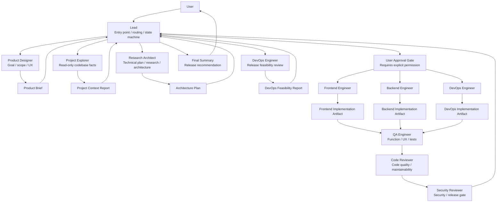
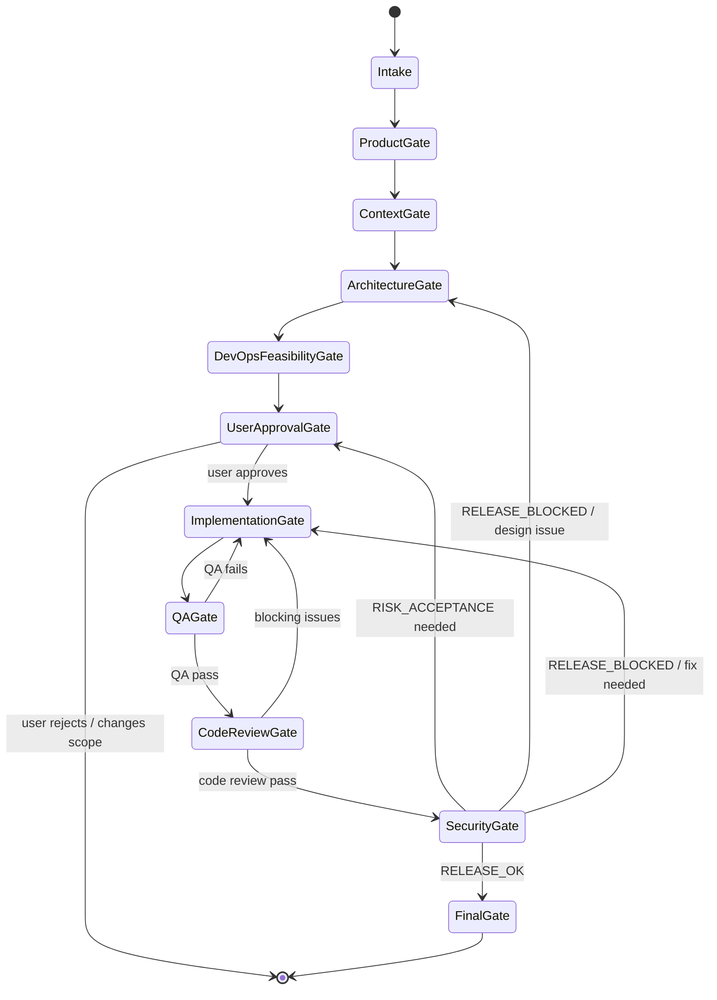

# Agent Team Architecture

This document explains how the Agent Team protocol works.

The user only talks to Lead. Lead routes work through gates. Specialist agents produce artifacts. Review agents inspect evidence independently. Release requires QA, Code Review, and Security Review.

## System Architecture



## Execution Flow



## Core Principles

- User only commands Lead.
- Lead coordinates but does not bypass specialist judgment.
- Every agent works inside its own gate.
- Every gate produces an artifact or a clearly stated equivalent.
- Downstream agents consume artifacts, not private reasoning from upstream agents.
- Reviewers do not rely on engineer private reasoning.
- Any execution action requires explicit user permission first.
- QA, Code Review, and Security Review are hard release gates.
- Security Reviewer can veto release.

## Why This Works

```text
Subagent independent context = prevents minds from blending together
Artifact handoff = prevents workflow from blending together
Gate = prevents permission drift and skipped steps
Loop rules = allow failure recovery without restarting everything
```

## Default Gate Order

```text
Intake
 -> Product
 -> Project Context
 -> Architecture
 -> Release Feasibility
 -> User Approval
 -> Implementation
 -> QA
 -> Code Review
 -> Security
 -> Final
```

## Release Rule

Lead may summarize release readiness, but Lead cannot override QA, Code Review, or Security Review.

Security decisions are:

```text
RELEASE_OK
RELEASE_OK_WITH_RISK_ACCEPTANCE
RELEASE_BLOCKED
```

If Security returns `RELEASE_BLOCKED`, the system must not recommend release.
