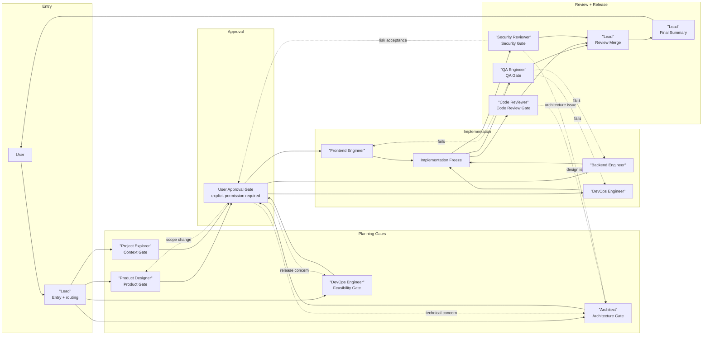
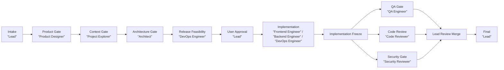
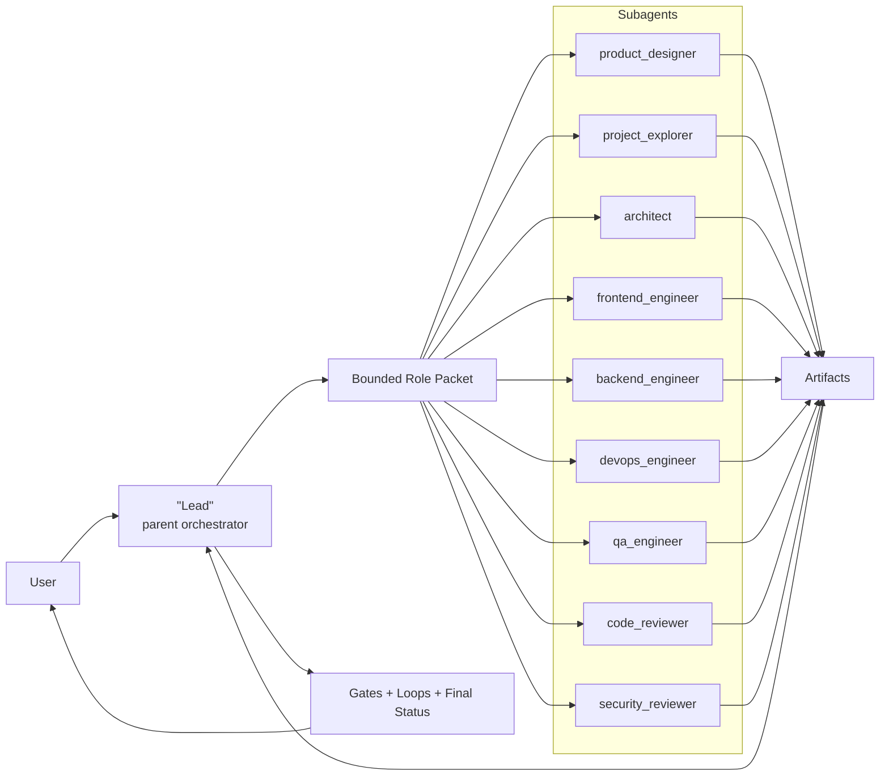
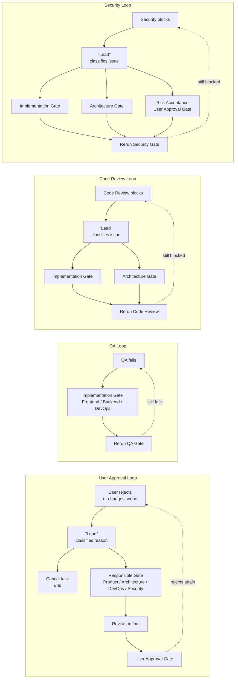

# Agent Team Architecture

This document explains how the Agent Team protocol works.

The user only talks to Lead. Lead routes work through gates. Specialist agents produce artifacts. Review agents inspect evidence independently. Release requires QA, Code Review, and Security Review.

Agent Team uses one Subagent Mode. Lead dispatches selected roles through bounded Role Packets and Codex custom agents in `.codex/agents/*.toml`. Lead validates each Role Packet before dispatch and validates returned artifacts before marking gates passed. Each role returns artifacts to Lead. If subagent threads are unavailable, Lead must report `SUBAGENT_UNAVAILABLE` instead of silently merging roles into one shared context.

## System Architecture

This diagram is intentionally square and layered. Solid arrows are the normal path. Dotted arrows are recovery paths.



## Execution Flow

This diagram shows only the main gate order. Rejections and failures are handled in the loop diagram below.



## Subagent Layer

Subagents do not change the gate order. They change how a role phase is executed.



Lead is not a subagent. Lead is the parent orchestrator.

Subagent Mode is strongest for independent exploration, architecture checks, QA, code review, and security review. Implementation subagents can write files only after explicit user approval and only when ownership boundaries are clear.

If subagent execution is unavailable, the workflow is blocked until the user enables subagents or explicitly waives subagent independence for that task.

Only Lead may dispatch subagents. After implementation freeze, Lead may fan out QA, Code Review, and Security Review in parallel. Lead then merges the returned artifacts, but does not redo or override specialist judgment.

## Rejection And Recovery Loops

User rejection is not always the end. Lead classifies the reason, sends the work back to the nearest responsible gate, then returns the corrected work to the matching approval or review gate.



## Core Principles

- User only commands Lead.
- Lead coordinates but does not bypass specialist judgment.
- Every agent works inside its own gate.
- Every gate produces an artifact or a clearly stated equivalent.
- Downstream agents consume artifacts, not private reasoning from upstream agents.
- Reviewers do not rely on engineer private reasoning.
- Subagent output must return as artifacts before downstream gates consume it.
- Any execution action requires explicit user permission first.
- QA, Code Review, and Security Review are hard release gates.
- Security Reviewer can veto release.

## Why This Works

```text
Subagent context = prevents minds from blending together
Role Packet = keeps each subagent bounded to allowed inputs
Artifact handoff = prevents workflow from blending together
Gate = prevents permission drift and skipped steps
Loop rules = allow failure recovery without restarting everything
```

## Default Gate Order

```text
Intake
 -> Product
 -> Project Context
 -> Architecture
 -> Release Feasibility
 -> User Approval
 -> Implementation
 -> QA
 -> Code Review
 -> Security
 -> Final
```

## Release Rule

Lead may summarize release readiness, but Lead cannot override QA, Code Review, or Security Review.

Security decisions are:

```text
RELEASE_OK
RELEASE_OK_WITH_RISK_ACCEPTANCE
RELEASE_BLOCKED
```

If Security returns `RELEASE_BLOCKED`, the system must not recommend release.
